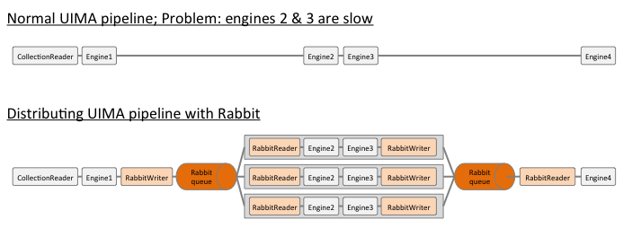

# Rabbit UIMA lightweight integration

A very simple and lightweight way to distribute a UIMA pipeline over a RabbitMQ queue.

Alternative you might want to check:

* [UIMA DUCC](http://uima.apache.org/doc-uimaducc-whatitam.html)
* [UIMA AS](http://uima.apache.org/doc-uimaas-what.html)
